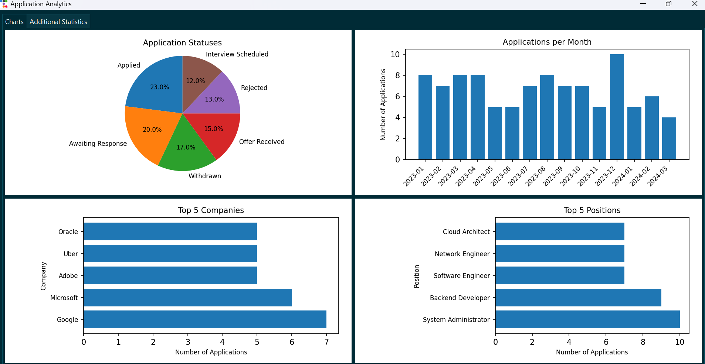
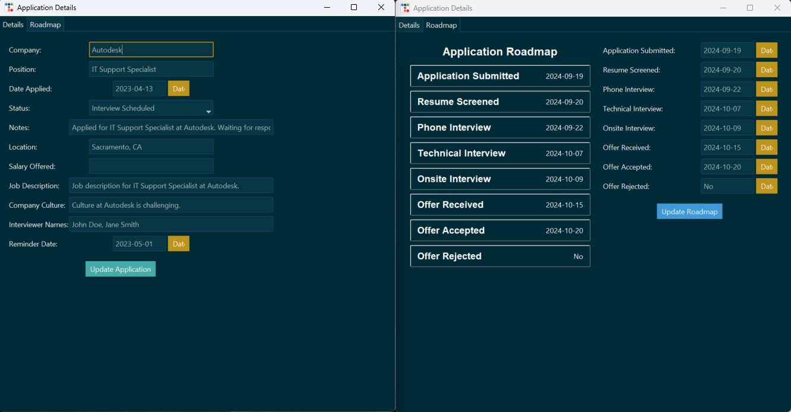
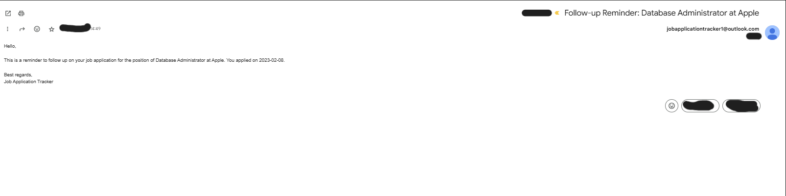
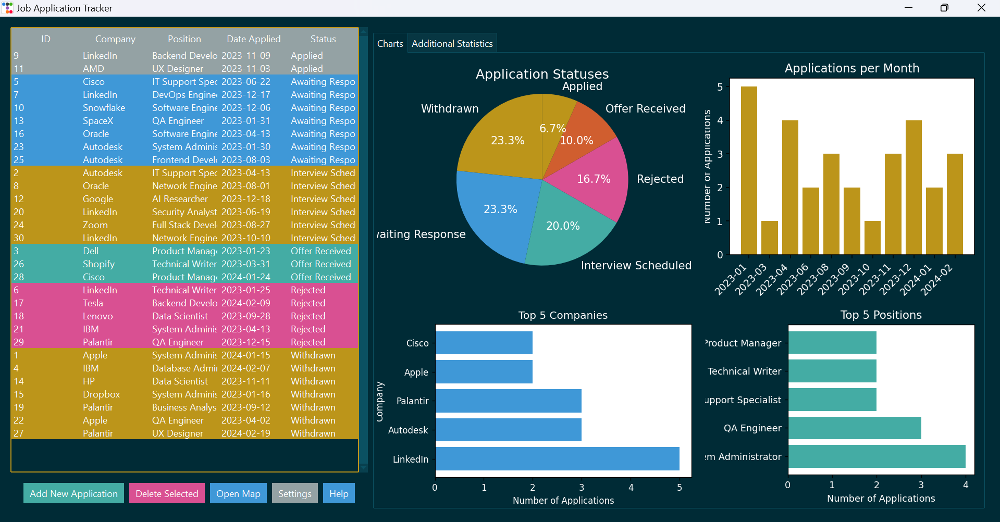
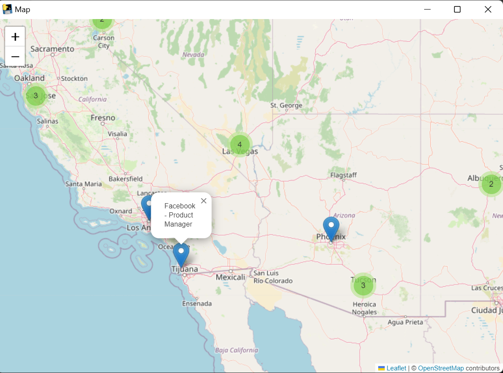
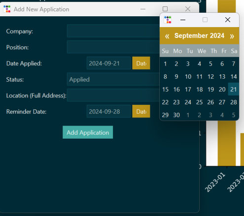
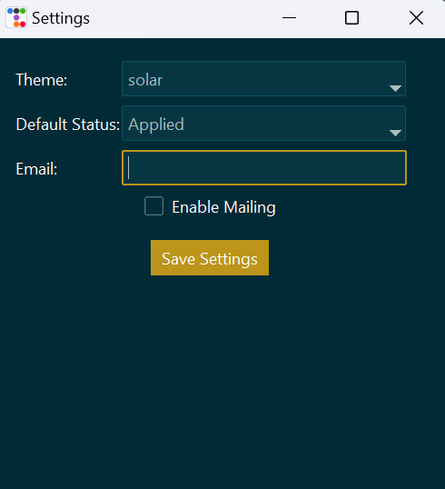

# Job Application Tracker










## Overview

Job Application Tracker is a comprehensive desktop application designed to help job seekers manage and organize their job application process. Built with Python and Tkinter, this application provides an intuitive interface for tracking job applications, analyzing application data, and managing the job search process effectively.

## Features

- **Application Management**: Add, edit, and delete job applications with ease.
- **Detailed Application Tracking**: Record company details, position, application date, status, notes, and more.
- **Application Roadmap**: Track the progress of each application through various stages (e.g., resume screened, interview scheduled, offer received).
- **Interactive Map View**: Visualize the geographical distribution of your job applications.
- **Analytics Dashboard**: Gain insights into your job search with charts and statistics.
- **Reminders**: Set and receive reminders for follow-ups and important dates with email system.
- **Customizable Settings**: Personalize the application theme and default values.
- **Data Persistence**: All data is stored locally in a SQLite database.

## Installation

1. Ensure you have Python 3.7+ installed on your system.
2. Clone this repository:
   ```
   git clone https://github.com/yourusername/job-application-tracker.git
   ```
3. Navigate to the project directory:
   ```
   cd job-application-tracker
   ```
4. Install the required dependencies:
   ```
   pip install -r requirements.txt
   ```

## Usage

To start the application, run:

```
python main.py
```

### Main Features:

1. **Adding a New Application**: Click "Add New Application" and fill in the details.
2. **Viewing Applications**: All applications are displayed in the main table.
3. **Editing an Application**: Double-click on an application in the table to view or edit its details.
4. **Deleting an Application**: Select an application and click "Delete Selected".
5. **Map View**: Click "Open Map" to see the geographical distribution of your applications.
6. **Analytics**: View charts and statistics about your applications on the right side of the main window.
7. **Settings**: Click "Settings" to customize the application theme and receiving email reminders.
8. **Help**: Click "Help" to get step-by-step instructions that explain how to use each feature of the app.

## Contributing

Contributions to the Job Application Tracker are welcome! Here are some ways you can contribute:

1. Report bugs and suggest features by opening issues.
2. Submit pull requests with bug fixes or new features.
3. Improve documentation or add translations.


## Support

If you encounter any issues or have questions, please file an issue on the GitHub repository.

Happy job hunting!
